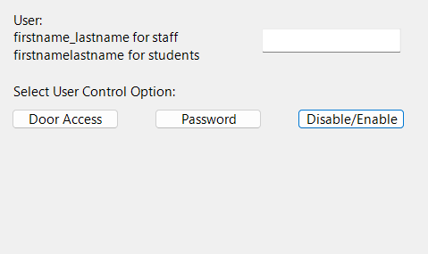

# Simple Gui for adding user to AD Security Groups.

This PowerShell script is a simple WinForm gui app that allows the user to assign or remove AD group membership to a specified user. In this specific example, we use it to select the user, their building label, and access tier so they can be assigned building access via AD.

## Functions

### AddOrRemoveUserFromGroup

This function adds or removes a user from a security group for a specified building and tier.

Within we call several Parameters,  `$group = "SG-$building-D-Tier-$tier"`. For our example, All of the security groups we will be referencing only have 2 variables that change, and we are able to define them in the Form Controls section of the code later on. This makes it easier for the end user to select the desired groups without having to know the full name of any of your security groups. 


#### Parameters

- `$user`: The username of the user to add or remove from the security group. 
- `$building`: The name of the security building to which access is being assigned or removed. 
- `$tier`: The security tier to which access is being assigned or removed. 
- `$removeAccess`: A boolean value indicating whether access is being granted or removed. If this parameter is set to `$true`, the user will be removed from the security group. If it is set to `$false`, the user will be added to the security group. This parameter is optional.


Adjust the `$building` `tier` and `$group` variables to suite your use case.
### TierDefButton_Click

This function displays a popup window with the security tier definitions.

### AddUserButton_Click

This function handles the "Add User" button click and calls the `AddOrRemoveUserFromGroup` function.

### GetGroupsButton_Click

This function displays a list of the groups associated with the specified user.

## Form Controls

The following form controls are used in this script:

- `$userLabel`: A label indicating where to enter the user's username.
- `$userTextBox`: A text box for entering the user's username.
- `$buildingLabel`: A label indicating where to select the building.
- `$buildingComboBox`: A dropdown list for selecting the building.
- `$tierLabel`: A label indicating where to select the security tier.
- `$tierComboBox`: A dropdown list for selecting the security tier.
- `$addButton`: A button for adding or removing the user from the security group.
- `$removeAccessCheckBox`: A checkbox for indicating whether access is being granted or removed.
- `$getGroupsButton`: A button for displaying the groups associated with the specified user.
- `$tierDefButton`: A button for displaying the security tier definitions.

## Usage



To use this script, run it in PowerShell or download the EXE file(TBD) and fill in the required fields.

:::note
You must have the Active Directory PowerShell Module installed to run the script
:::

## Code

```powershell

# Simple WinForm for adding user to security building.
## This app is specifically for assigning door access


Set-Location $PSScriptRoot

#--------------Functions-------------------------------

#Function to add user to group or remove them if $removeAccess is true
function AddOrRemoveUserFromGroup($user, $building, $tier, $removeAccess) {
	$group = "SG-$building-D-Tier-$tier"
	try {
		if ($removeAccess) {
			Remove-ADGroupMember -Identity $group -Members $user -Confirm:$false
			[System.Windows.Forms.MessageBox]::Show("User removed from $group")
		} else {
			Add-ADGroupMember -Identity $group -Members $user
			[System.Windows.Forms.MessageBox]::Show("User added to $group")
		} 
	} catch {
		[System.Windows.Forms.MessageBox]::Show("Error modifying user access: `r`n$($_.Exception.Message)")
	}
}


## Create Tier Definitions Popup window
function TierDefButton_Click{
	$message = "Security Tier Definitions:`n`n" +
						 "Tier 1 provides 24/7 access`n" +
						 "Tier 2 allows access between 5:30am - 8:00pm 7 days a week`n" +
						 "Tier 3 allows access between 5:30am - 6:30pm Mon-Fri"
	[System.Windows.Forms.MessageBox]::Show($message)
}


# Handles Add user button click to call the function

function AddUserButton_Click() {
	$user = Get-ADUser $userTextBox.Text
	$building = $buildingComboBox.SelectedItem.ToString()
	$tier = $tierCombobox.SelectedItem.ToString()
	$removeAccess = $removeAccessCheckBox.Checked

	AddOrRemoveUserFromGroup $user $building $tier $removeAccess
}

# Create User group list
function GetGroupsButton_Click() {
	$user = Get-ADUser $userTextBox.Text
	$user_groups = Get-ADPrincipalGroupMembership -Identity $user | Select-Object -ExpandProperty Name 
	$message = "Groups associated with user: `n" + ($user_groups -join "`n")
	[System.Windows.Forms.MessageBox]::Show($message)
}
#------------------Building The Gui----------------------------

# Setting up the form
Add-type -AssemblyName System.Windows.Forms
Add-type -AssemblyName System.Drawing


$iconFilePath = Join-Path $PSScriptRoot 'logo.ico'
$icon = [System.Drawing.Icon]::ExtractAssociatedIcon($iconFilePath)
$form = New-Object System.Windows.Forms.Form
$form.Icon = $icon
$form.Text = "Door Access"
$form.Width = 500
$form.Height = 300

$form.StartPosition = "CenterScreen"
$form.BackColor = [System.Drawing.Color]::DarkGray
$form.FormBorderStyle = 'Fixed3D'
$form.Font = New-Object System.Drawing.Font("Segoe UI", 11)


# Add a custom title bar control


# Add Text Box for User
$userLabel = New-Object System.Windows.Forms.Label
$userLabel.Text = "User:`nfirstname_lastname for staff`nfirstnamelastname for students"
$userLabel.Location = New-Object System.Drawing.Point(20, 20)
$userLabel.AutoSize = $true
$userLabel.TextAlign = [System.Drawing.ContentAlignment]::TopLeft

$userTextBox = New-Object System.Windows.Forms.TextBox
$userTextBox.Location = New-Object System.Drawing.Point(300, 40)
$userTextBox.Width = 150
$userTextBox.Anchor = [System.Windows.Forms.AnchorStyles]::Top -bor [System.Windows.Forms.AnchorStyles]::Left -bor [System.Windows.Forms.AnchorStyles]::Right


# Add DropDown for Building Selection
$buildingLabel = New-Object System.Windows.Forms.Label
$buildingLabel.Text = "Select The Building: "
$buildingLabel.Location = New-Object System.Drawing.Point(20, 100)
$buildingLabel.AutoSize = $true
$buildingComboBox = New-Object System.Windows.Forms.ComboBox
$buildingComboBox.Location = New-Object System.Drawing.Point(300,100)
$buildingComboBox.Width = 150
$buildingComboBox.Items.Add("SO")
$buildingComboBox.Items.Add("WE")
$buildingComboBox.Items.Add("GR")
$buildingComboBox.Items.Add("MS")
$buildingComboBox.Items.Add("HS")
$buildingComboBox.Items.Add("TR")
$buildingComboBox.Items.Add("CO")
$buildingComboBox.Items.Add("SPF")

# Add Dropdown for Door Tiers
$tierLabel = New-Object System.Windows.Forms.Label
$tierLabel.Text = "Tier: "
$tierLabel.Location = New-Object System.Drawing.Point(20, 140)
$tierLabel.AutoSize = $true
$tierCombobox = New-Object System.Windows.Forms.ComboBox
$tierCombobox.Location = New-Object System.Drawing.Point(300, 140)
$tierCombobox.Width = 150
$tierCombobox.Items.Add("1")
$tierCombobox.Items.Add("2")
$tierCombobox.Items.Add("3")

# Add "Add User" Button
$addButton = New-Object System.Windows.Forms.Button
$addButton.Text = "Assign Access"
$addButton.Location = New-Object System.Drawing.Point(300, 180)
$addButton.Width = 150
$addButton.Add_Click({AddUserButton_Click})
$form.AcceptButton = $addButton

# Add Remove access checkbox
$removeAccessCheckBox = New-Object System.Windows.Forms.Checkbox
$removeAccessCheckBox.Text= "Check box to remove`n access instead of add"
$removeAccessCheckBox.Location = New-Object System.Drawing.Point(300, 210)
$removeAccessCheckBox.AutoSize = $true

# Add Current Groups Button
$getGroupsButton = New-Object System.Windows.Forms.Button
$getGroupsButton.Text = "View User's Groups"
$getGroupsButton.Location = New-Object System.Drawing.Point(20, 210)
$getGroupsButton.Add_Click({GetGroupsButton_Click})
$getGroupsButton.Width = 150

# Add Tier Definition Button
$tierDefButton = New-Object System.Windows.Forms.Button
$tierDefButton.Text = "Tier Descriptions"
$tierDefButton.Location = New-Object System.Drawing.Point(20, 180)
$tierDefButton.Width = 150
$tierDefButton.Add_Click({TierDefButton_Click})

# Form Controls

$form.Controls.Add($userLabel)
$form.Controls.Add($userTextBox)
$form.Controls.Add($buildingLabel)
$form.Controls.Add($buildingComboBox)
$form.Controls.Add($tierLabel)
$form.Controls.Add($tierCombobox)
$form.Controls.Add($addButton)
$form.Controls.Add($tierDefButton)
$form.Controls.Add($removeAccessCheckBox)
$form.Controls.Add($getGroupsButton)

# Display form
$result = $form.ShowDialog()

```
