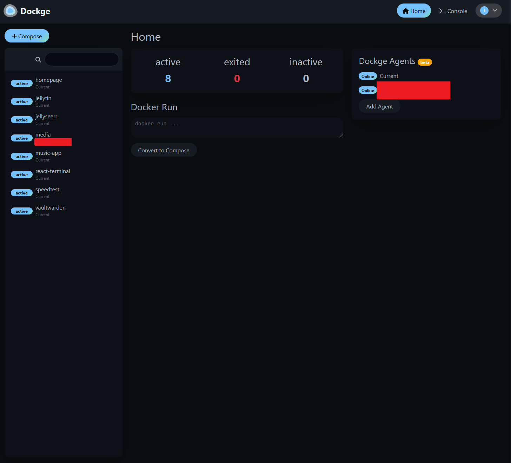

# Docker

Docker is an amazing tool for both software developers and hobbiest nerds alike and has a ton of depth to it. While I can't begin to cover everything it can do here, I'll do my best to give you a quick overview of what it is and how it works.
Lets start with installing it.

## Installing Docker

Docker provides us a nice script to install the latest version of docker. Simply copy the following into your terminal and run it on both VMs.

```bash copy
echo "Installing Docker"
for pkg in docker.io docker-doc docker-compose docker-compose-v2 podman-docker containerd runc; do sudo apt-get remove $pkg; done
# Add Docker's official GPG key:
sudo apt-get update
sudo apt-get install ca-certificates curl gnupg
sudo install -m 0755 -d /etc/apt/keyrings
curl -fsSL https://download.docker.com/linux/ubuntu/gpg | sudo gpg --dearmor -o /etc/apt/keyrings/docker.gpg
sudo chmod a+r /etc/apt/keyrings/docker.gpg

# Add the repository to Apt sources:
echo \
  "deb [arch=$(dpkg --print-architecture) signed-by=/etc/apt/keyrings/docker.gpg] https://download.docker.com/linux/ubuntu \
  $(. /etc/os-release && echo "$VERSION_CODENAME") stable" | \
  sudo tee /etc/apt/sources.list.d/docker.list > /dev/null
sudo apt-get update

sudo apt-get install docker-ce docker-ce-cli containerd.io docker-buildx-plugin docker-compose-plugin

echo "finished installing docker"
```

## Our First Docker Container

Now that we have docker installed, on both vms of course, we'll want to start off with our first container. This container we'll install on both VMs, as it makes managing the rest of them much easier. This container is called Dockge. Dockge is a web interface for managing docker containers.

Docker apps are commonly installed via a docker-compose file. These files give specific instructions to docker like how to build the container, what ports to expose, and what volumes to mount. We'll be using a docker-compose file to install dockge, which then allows us to manage compose files from a web interface. They gave us a nice little script to create a directory for all of our future compose files, then install dockge. The bonus is, once we've installed it on both machines, we'll be able to manage all containers from both machines from a single web interface.

Here's the script:

```bash copy
# Create directories that store your stacks and stores Dockge's stack
mkdir -p /opt/stacks /opt/dockge
cd /opt/dockge

# Download the compose.yaml
curl https://raw.githubusercontent.com/louislam/dockge/master/compose.yaml --output compose.yaml

# Start the server
docker compose up -d
```

Once that has finished installing you can now go to the Dockge app in your browser at http://YourPrimaryVMIP:5001 make sure to replace YourPrimaryVMIP with the IP address of your primary VM. You should see a screen like this:

minus the containers I'm running of course. Under Dockge Agents, you can click Add Agent, and enter the IP of your media retrieval vm and now you'll be able to manage containers on both VMs from a single interface.

Now lets install some apps!

Guides will be seperated into 2 sections. One for your primary, more powerful VM, and one for the media retrieval VM which will be behind a VPN.
