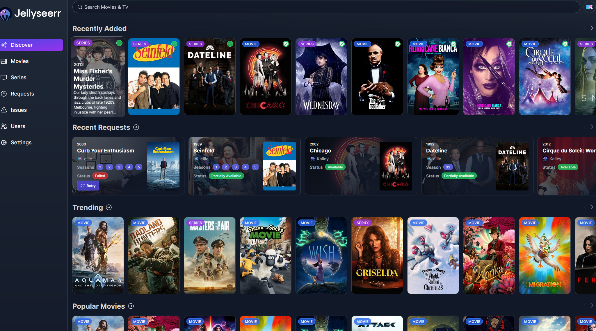

# Overseerr / Jellyseerr

The Seerr apps are the magic that makes the whole thing work seemlessly. They are the apps that will be used to request content and manage the content that is requested. After going to the ip address and port of either jellyseerr or overseerr,
it'll have you connect via your plex or jellyfin account, then it will ask you to connect to sonarr and radarr using the API keys from before. Once you've done that, you're all set to start requesting content! Theres more settings you can configure like user permissions and even a discord bot!
