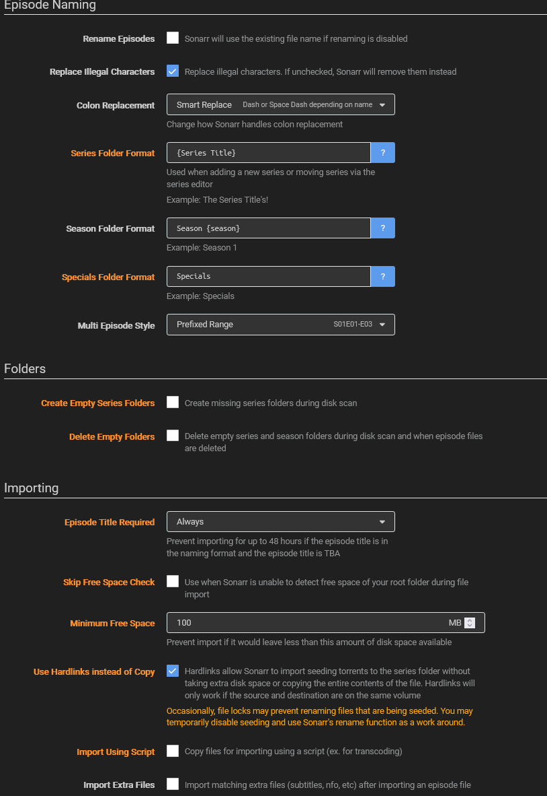
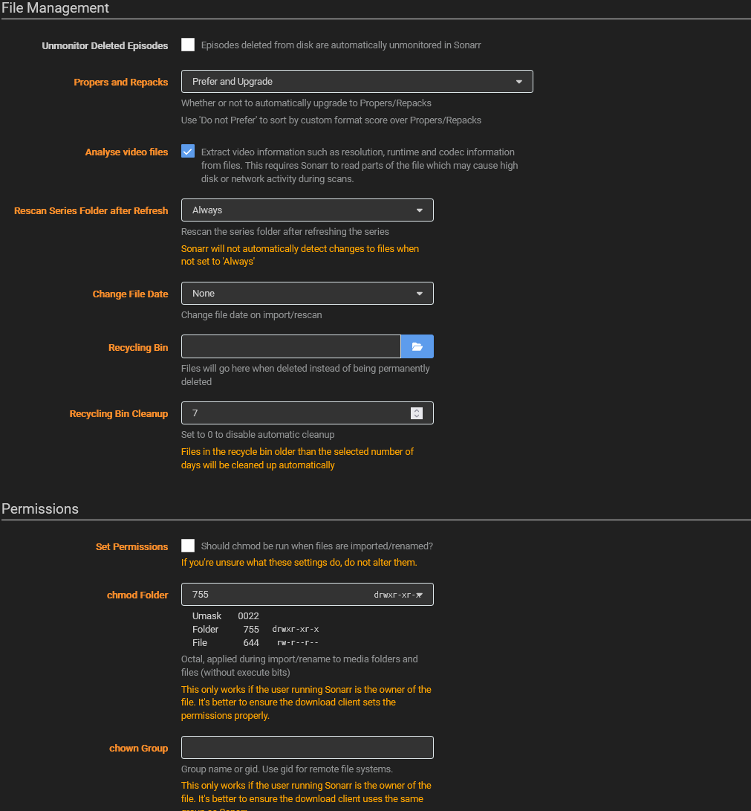

import { Callout } from 'nextra/components';

# Prowlarr/Sonarr/Radarr

These apps are all created by the same developer and all share a similar interface. So I'll just cover them all here, You'll want to open all 3 apps.

## Prowlarr

### Indexers

Starting with Prowlarr, you'll want to start by adding the sites you'll want to search.

From the main page, the Indexers tab, click the big plus button to add a new indexer. Add whichever you want, i'd filter by Protocal: Torrent and Privacy: Public. I'd recommend adding at least 3-4 indexers, but don't add too many, as it'll slow down your searches. For legal reasons, I can't recommend any specific indexers, but you can find all your favorites like the bay of pirates and kick booty torrents, if you know what I mean.

### Download Clients

<Callout type='info'> This step also applies to Sonarr and Radarr </Callout>

Go to settings, download clients, and add Deluge with the ip address of this VM and the port of 8112 and the password.

### Apps

Here, you'll set up Sonarr and Radarr. Move on to the next section to set them up, then come back to Prowlarr with the API Keys for each and connect them to Prowlarr.

## Sonarr and Radarr

The settings for these 2 apps are almost identical, so I'll just cover them both here. The only difference will be the root folders.

### Media Management

<Callout type='info'> Do this for both Sonarr and Radarr </Callout>

Open Sonarr and Radarr by going to their url `http://<ip>:8989` and `http://<ip>:7878` respectively.

Go to settings, media management, and click 'Show Advanced' to make sure you see all the options. These options are mostly up to you, I'll screenshot my settings below.

At the bottom of this page is where you'll set the Root folders which will be different for sonarr and radarr. For sonarr you will have 2. /anime and /tv. For radarr you will just have /movies.

### Download Clients

Do the step from Prowlarr here.

### General

Under the general tab, under Security, you will find the API key for your app. This is what you will copy and paste into the `APPS` section of Prowlarr. You will also need this when we set up Overseerr/Jellyseerr.
