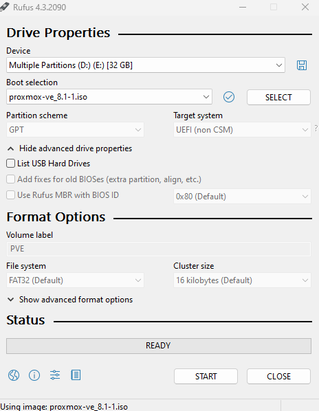
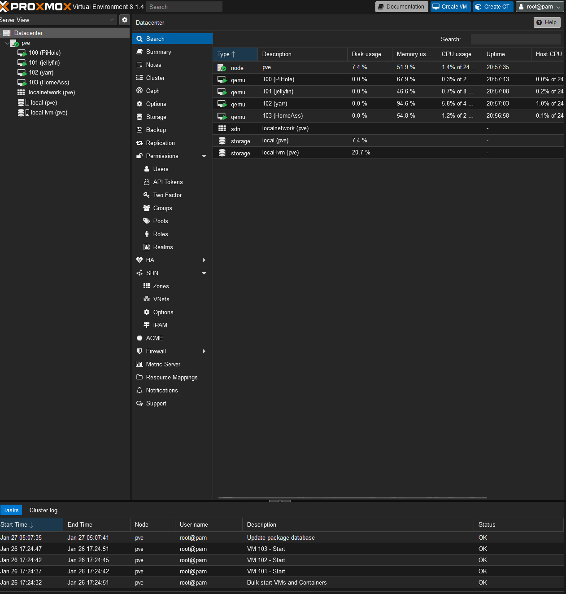

import { Callout } from 'nextra/components';

# Proxmox

## Why you should use a hypervisor

Proxmox is a hypervisor, basically a virtual machine manager. It allows you to run multiple virtual machines, self contained operating systems, on a single physical machine. Proxmox is free and can run on almost
any hardware. And its super easy to use with a web based interface. So lets get started.

## Installation

To get started, you'll need an 8gb flash drive, the proxmox iso image, and software to mount the image to a flash drive.

### Download the iso

You can get the iso for Proxmox from their website here: https://www.proxmox.com/en/proxmox-virtual-environment/get-started

<Callout
	type='info'
	emoji='?'
>
	On older hardware, versions 7 and 8 may not be able to install via flash
	drive. You'll need to download 6.4 then update from the proxmox ui after
	installation if you run into problems installing the latest version but the
	steps are the same.
</Callout>

### Mount the iso with Rufus

I personally prefer to use Rufus to mount the iso to a flash drive. You can download Rufus here: https://rufus.ie/en_US/

Open Rufus and select your flash drive. Then select the iso image you downloaded. Then click start. This will mount the iso to the flash drive.

### Boot from the flash drive and install

Now that you have the iso mounted to the flash drive, you can boot from it. You may need to change your boot order in your bios to boot from the flash drive. Once you boot from the flash drive, you'll be presented with a menu. Select install proxmox. Then follow the prompts to install proxmox. Once the installation is complete, you'll be prompted to continue setup from a webbrowser at the shown url and port. The default username is `root` and the password is the one you set during installation.

## Proxmox UI and first steps

Once you've logged into the web interface, you'll be greeted with this layout, minus the VMs, you haven't created any yet.

From this screen is where all the magic happens. You'll create VMs, storage pools for the vms, and so much more. There are a ton of options and I recommend you explore them all and look up some youtube videos on proxmox to get a better understanding of what you can do with it. But for now, we'll stick to the basics for our media server. Continue on to the Ubuntu section to get started with creating your first VM.