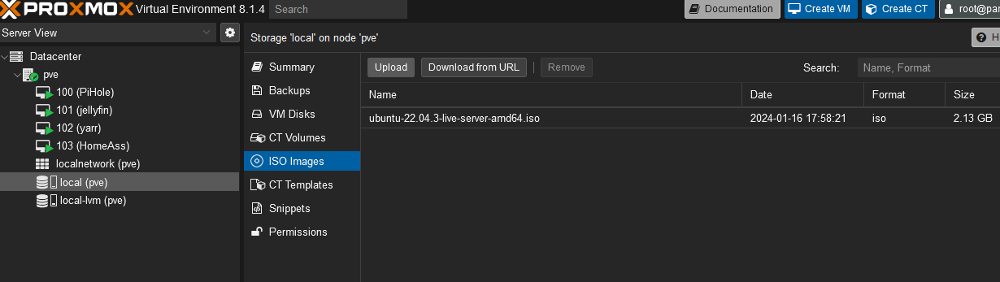
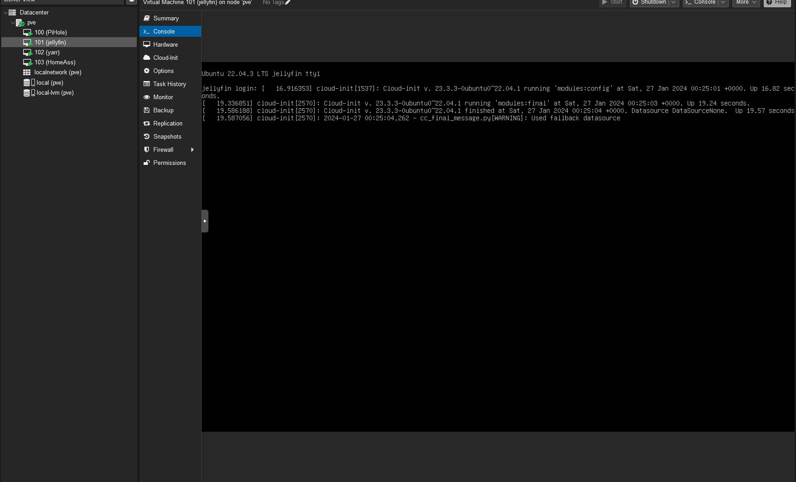

# Ubuntu Server

## Download Ubuntu Server and Uploading to Proxmox

We'll start off by downloading the ISO file for Ubuntu Server, which is the exact same OS as Ubuntu Desktop, but without the GUI. You can download the ISO here [Ubuntu](https://ubuntu.com/download/server).

Proxmox makes it quite easy to upload ISO files to the server. Simply click on the `local` storage on the left hand side, then click on `ISO Images` and then click on `Upload`.


## Creating a VM

Now that we have the ISO uploaded, we can create a VM. In the top right corner, click on `Create VM`. Now lets walk through each step. Keep in mind for this guide, we will want 2 Ubuntu VMs, so you'l follow these steps twice save for one exception with the 'media retriaval cough cough' vm that'll be explained later.

### General

You can ignore all fields, except name, name the vm something like "Media" or "Plex" or "Jellyfin".

### OS

Choose `USe CD/DVD disc image file` and next to ISO image: select the Ubuntu Server ISO we uploaded earlier. then click next.

### System

You will leave everything default unless your system has a dedicated GPU which you will want to pass to the Plex or Jellyfin VM. If you have a gpu, do some research on the best passthrough method for your system. Mine doesnt use one, so we'll skip this step.

### Disks

Here is where you will define the storage for the vms. I would do a minimum of 32gbs for each. I personally use 100gb for Jellyfin for metadata and hardware transcodes. For the media retrieval, I use the 32gb because I mount my NAS drive to the vm for the majority of storage. If you are using proxmox's storage options instead of a NAS, you'll add that here.

### CPU

For the CPU, I gave the Jellyfin/Plex vm 2 Sockets with 4 cores each. For the media retrieval vm, I gave it 1 socket with 4 cores. This is because the media retrieval vm will only be used to download media, and not transcode it. The Jellyfin/Plex vm will be used to transcode the media, so it will need more cores.

### Memory

For the memory, I gave the Jellyfin/Plex vm 8gb of ram, and the media retrieval vm 4gb of ram. This is because the media retrieval vm will only be used to download media, and not transcode it. The Jellyfin/Plex vm will be used to transcode the media, so it will need more ram.

### Network

The default bridge should already be created for you, so you can leave this as is. If for some reason it is not, you can create it by clicking on `Datacenter` on the left hand side, then click on `Network` and then click on `Create` and then `Linux Bridge`. Name it `vmbr0` and click create.

For the media retrieval VM, if you intend to do a vpn from your router, you will want to add a VLAN tag. This is the method I used, and I chose 100 for the vlan tag. It can be whatever you want, as long as it matches the vlan tag on your router. If you do not intend to do a vpn from your router, you can leave this blank.

### Confirm

Verify that everything looks correct, check the box that says `Start after created` and then click `Finish`.

## Ubuntu software installation

Once you've created a new VM, you'll see it on the left hand pannel, under pve. Select it and click console. This will bring up a terminal window. You'll want to follow the steps below for each VM you created.


You'll have to follow the basic OS installation from here, but afterwords if you want to ssh into the VM from your favorite terminal application, you'll be able to do so. Go through the basic prompts for setting up ubuntu, being sure to enable the open ssh server. Once you've completed the installation, you'll want to ssh into the VM. You can do this by typing `ssh username@ipaddress` into your terminal. The username will be the username you created during the installation, and the ipaddress will be the ipaddress of the VM. You can find the ipaddress of the VM by typing `ip a` into the console on proxmox.

And thats it! You're into your new VM. Lets get some house keeping out of the way.

## House Keeping

### Updating the OS

The first thing you'll want to do is make sure you're up to date.

```bash
sudo apt update && sudo apt upgrade -y
```

### Mounting the NFS Share

If you already have your NFS share configured on your NAS, you can mount it now, or refer back to this section after you've configured your NFS share on your NAS.

First, create a folder to mount the NFS share to. We'll call it server and add it to the mnt folder in the root Directory

```bash
sudo mkdir /mnt/server
```

Then, we'll need to install the NFS client

```bash
sudo apt install nfs-common
```

Then we'll want to edit the FSTAB file. This file is used to mount drives on boot. We'll first edit the file with nano, then add the line to mount the NFS share.

```bash
sudo nano /etc/fstab
```

```bash
# add this line to the bottom of the file, replacing the NASIPADDRESS and nameOfShare with your NAS ip address and the name of the share you created on your NAS

NASIPADDRESS:/mnt/nameOfShare /mnt/server nfs defaults 0 0
```

Save the file and exit nano by pressing `ctrl + x` and then `y` and then `enter`
then you can mount the share by typing

```bash
sudo mount -a
```

### Setting a Static IP

I highly recommend setting a static IP for both VMs. If you want to do this through your router, you can skip this step. If you want to do this through the VM, follow the steps below.

Start by editing the netplan file

```bash
sudo nano /etc/netplan/00-installer-config.yaml
```

and replace the contents with the following, replacing the ip address with the ip address you want to use, and the gateway and dns with the ip address of your router and the dns to whichever you prefer.

```bash
# This file describes the network interfaces available on your system
# For more information, see netplan(5).
network:
  version: 2
  renderer: networkd
  ethernets:
    enp0s3: # This is the name of the network interface, and will likely be different for you. Keep whatever it is for you when you first open this file.
     dhcp4: no
     addresses: [10.50.1.4/24] # I use the 10.50.0.0 network for my VMs, if you don't have a custom setup, the defaults will be 192.168.1.whateverNumberYouWant/24
     gateway4: 10.50.1.1 # This is the ip address of your router
     nameservers:
       addresses: [8.8.8.8,8.8.4.4] # These are the dns servers, you can use whatever you want here

```

Then apply the changes

```bash
sudo netplan apply
```

Thats it for the house keeping. Now onto Docker!
