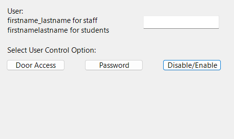
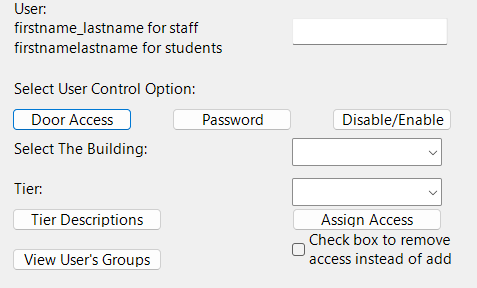
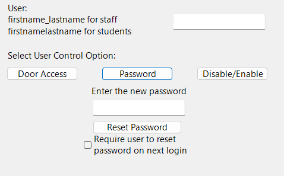
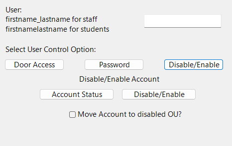

import { Callout } from 'nextra/components';

# Simple Gui App written in Powershell for doing simple AD commands.

This PowerShell script is a simple WinForm gui app that allows the user to assign or remove AD group membership to a specified user, reset their password, or disable/enable their account.

## Functions

This App is tailored for a specific use case, but can be customized simply by adjusting variables

### AddOrRemoveUserFromGroup

This function adds or removes a user from a security group for a specified building and tier.

Within we call several Parameters, `$group = "SG-$building-D-Tier-$tier"`. For our example, All of the security groups we will be referencing only have 2 variables that change, and we are able to define them in the Form Controls section of the code later on. This makes it easier for the end user to select the desired groups without having to know the full name of any of your security groups.

#### Parameters

- `$user`: The username of the user to add or remove from the security group.
- `$building`: The name of the security building to which access is being assigned or removed.
- `$tier`: The security tier to which access is being assigned or removed.
- `$removeAccess`: A boolean value indicating whether access is being granted or removed. If this parameter is set to `$true`, the user will be removed from the security group. If it is set to `$false`, the user will be added to the security group. This parameter is optional.

Adjust the `$building` `tier` and `$group` variables to suite your use case.

## Usage






To use this script, run it in PowerShell or download the EXE file(TBD) and fill in the required fields.

<Callout
	type='info'
	emoji='i'
>
	You must have the Active Directory PowerShell Module installed to run the
	script
</Callout>

## Code

```powershell

# Simple WinForm for adding user to security building.
## This app is specifically for assigning door access


Set-Location $PSScriptRoot


$global:creds = $null


#--------------Functions-------------------------------


##-------Door Access Functions-------

#Function to add user to group or remove them if $removeAccess is true
function AddOrRemoveUserFromGroup($user, $building, $tier, $removeAccess) {
	$group = "SG-$building-D-Tier-$tier"
	try {
		if ($removeAccess) {
			Remove-ADGroupMember -Identity $group -Members $user -Confirm:$false
			[System.Windows.Forms.MessageBox]::Show("User removed from $group")
		} else {
			Add-ADGroupMember -Identity $group -Members $user
			[System.Windows.Forms.MessageBox]::Show("User added to $group")
		}
	} catch {
		[System.Windows.Forms.MessageBox]::Show("Error modifying user access: `r`n$($_.Exception.Message)")
	}
	$group | Out-String | % { [System.Windows.Forms.MessageBox]::Show($_) }
}


## Create Tier Definitions Popup window
function TierDefButton_Click{
	$message = "Security Tier Definitions:`n`n" +
						 "Tier 1 provides 24/7 access`n" +
						 "Tier 2 allows access between 5:30am - 8:00pm 7 days a week`n" +
						 "Tier 3 allows access between 5:30am - 6:30pm Mon-Fri"
	$message | Out-String | % { [System.Windows.Forms.MessageBox]::Show($_) }
	[System.Windows.Forms.MessageBox]::Show($message)
}


# Handles Add user button click to call the function

function AddUserButton_Click() {
	$user = Get-ADUser $userTextBox.Text
	$building = $buildingComboBox.SelectedItem.ToString()
	$tier = $tierCombobox.SelectedItem.ToString()
	$removeAccess = $removeAccessCheckBox.Checked

	AddOrRemoveUserFromGroup $user $building $tier $removeAccess
}

# Create User group list
function GetGroupsButton_Click() {
	$user = Get-ADUser $userTextBox.Text
	$user_groups = Get-ADPrincipalGroupMembership -Identity $user | Select-Object -ExpandProperty Name
	$message = "Groups associated with user: `n" + ($user_groups -join "`n")
	[System.Windows.Forms.MessageBox]::Show($message)
}


#------Password Reset Function---------
function passwordButton_Click() {
	$user = Get-ADuser $userTextBox.Text
	$password = ConvertTo-SecureString -String $passwordTextBox.Text -AsPlainText -Force
	$pwmessage = "The password has been changed"
	$resetpassword = $passwordCheckBox.Checked
	try{
		Set-AdAccountPassword -Identity $user -NewPassword $password -Reset
		if ($resetpassword) {
			Set-ADUser -Identity $user -ChangePasswordAtLogon $true
		}
		[System.Windows.Forms.MessageBox]::Show($pwmessage)
	} catch {
		[System.Windows.Forms.MessageBox]::Show("Error modifying user access: `r`n$($_.Exception.Message)")
	}
}


#Account Status
function statusButton_Click() {
	$enabled = Get-ADUser $userTextBox.Text -Properties Enabled | Select-Object Enabled
	$enabled  | Out-String | % { [System.Windows.Forms.MessageBox]::Show($_) }
	[System.Windows.Forms.MessageBox]::Show($enabled)
}


#disable/enable account


function disableButton_Click(){
	$user = Get-ADuser $userTextBox.Text
	$enabledUser = Get-ADuser $userTextBox.Text -Properties Enabled | Select-Object Enabled
	try {
		if ($enabledUser.Enabled -eq $true){
			disable-ADAccount -Identity $user
			if ($moveOuBox.Checked) {
				Move-ADObject -Identity $user -TargetPath "OU=DisabledAccounts,DC=laurel,DC=local"
			}
			[System.Windows.Forms.MessageBox]::Show("The Ancount has been Disabled")
			}
		else {
			enable-ADAccount -Identity $user
			[System.Windows.Forms.MessageBox]::Show("The Ancount has been Enabled")
		}
	} catch {
		[System.Windows.Forms.MessageBox]::Show("Error modifying user access: `r`n$($_.Exception.Message)")
	}
}

#------------------Building The Gui----------------------------

# Setting up the form
Add-type -AssemblyName System.Windows.Forms | Where-Object { $_ -ne 0 } | Out-Null
Add-type -AssemblyName System.Drawing | Where-Object { $_ -ne 0 } | Out-Null
Add-Type -AssemblyName System.DirectoryServices.AccountManagement

$form = New-Object System.Windows.Forms.Form

$form.Text = "Lazy AD Tools"

$form.Width = 500
$form.Height = 350

$form.StartPosition = "CenterScreen"
$form.BackColor = [System.Drawing.Color]::Transparent
$form.FormBorderStyle = 'Fixed3D'
$form.Font = New-Object System.Drawing.Font("Segoe UI", 11)


# Add Text Box for User
$userLabel = New-Object System.Windows.Forms.Label
$userLabel.Text = "User:`nfirstname_lastname for staff`nfirstnamelastname for students"
$userLabel.Location = New-Object System.Drawing.Point(20, 20)
$userLabel.AutoSize = $true
$userLabel.TextAlign = [System.Drawing.ContentAlignment]::TopLeft

$userTextBox = New-Object System.Windows.Forms.TextBox
$userTextBox.Location = New-Object System.Drawing.Point(300, 40)
$userTextBox.Width = 150
$userTextBox.Anchor = [System.Windows.Forms.AnchorStyles]::Top -bor [System.Windows.Forms.AnchorStyles]::Left -bor [System.Windows.Forms.AnchorStyles]::Right


#-------------Function Selection---------

$selectLabel = New-Object System.Windows.Forms.Label
$selectLabel.text = "Select User Control Option: "
$selectLabel.Location = New-Object System.Drawing.Point(20,100)
$selectLabel.AutoSize = $true


$accessButton = New-Object System.Windows.Forms.Button
$accessButton.text = "Door Access"
$accessButton.Location = New-Object System.Drawing.Point(20, 130)
$accessButton.Width = 120
$accessButton.Add_Click({
	if ($buildingLabel.Visible -eq $false) {
		$buildingLabel.Visible = $true
		$buildingComboBox.Visible = $true
		$tierLabel.Visible = $true
		$tierCombobox.Visible = $true
		$addButton.Visible = $true
		$removeAccessCheckBox.Visible = $true
		$getGroupsButton.Visible = $true
		$tierDefButton.Visible = $true
		$passwordLabel.Visible = $false
		$passwordButton.Visible = $false
		$passwordTextBox.Visible = $false
		$passwordCheckBox.Visible = $false
		$statusButton.Visible = $false
		$disableButton.Visible = $false
		$disableLabel.Visible = $false
		$moveOuBox.Visible = $false

	} else {
		$buildingLabel.Visible = $false
		$buildingComboBox.Visible = $false
		$tierLabel.Visible = $false
		$tierCombobox.Visible = $false
		$addButton.Visible = $false
		$removeAccessCheckBox.Visible = $false
		$getGroupsButton.Visible = $false
		$tierDefButton.Visible = $false

	}
})

$passButton = New-Object System.Windows.Forms.Button
$passButton.text = "Password"
$passButton.Location = New-Object System.Drawing.Point(180, 130)
$passButton.Width = 120
$passButton.Add_Click({
	if ($passwordLabel.Visible -eq $false) {
		$buildingLabel.Visible = $false
		$buildingComboBox.Visible = $false
		$tierLabel.Visible = $false
		$tierCombobox.Visible = $false
		$addButton.Visible = $false
		$removeAccessCheckBox.Visible = $false
		$getGroupsButton.Visible = $false
		$tierDefButton.Visible = $false
		$passwordLabel.Visible = $true
		$passwordButton.Visible = $true
		$passwordTextBox.Visible = $true
		$passwordCheckBox.Visible = $true
		$statusButton.Visible = $false
		$disableLabel.Visible = $false
		$disableButton.Visible = $false
		$moveOuBox.Visible = $false

	} else {
		$passwordLabel.Visible = $false
		$passwordButton.Visible = $false
		$passwordTextBox.Visible = $false
		$passwordCheckBox.Visible = $false

	}
})


$enableButton = New-Object System.Windows.Forms.Button
$enableButton.text = "Disable/Enable"
$enableButton.Location = New-Object System.Drawing.Point(340, 130)
$enableButton.Width = 120
$enableButton.Add_Click({
	if ($statusButton.Visible -eq $false) {
		$buildingLabel.Visible = $false
		$buildingComboBox.Visible = $false
		$tierLabel.Visible = $false
		$tierCombobox.Visible = $false
		$addButton.Visible = $false
		$removeAccessCheckBox.Visible = $false
		$getGroupsButton.Visible = $false
		$tierDefButton.Visible = $false
		$passwordLabel.Visible = $false
		$passwordButton.Visible = $false
		$passwordTextBox.Visible = $false
		$passwordCheckBox.Visible = $false
		$statusButton.Visible = $true
		$disableLabel.Visible = $true
		$moveOuBox.Visible = $true
		$disableButton.Visible = $true
	} else {
		$statusButton.Visible = $false
		$disableLabel.Visible = $false
		$moveOuBox.Visible = $false
		$disableButton.Visible = $false

	}
})


#-------------Door Access Section-----------------------

# Add DropDown for Building Selection
$buildingLabel = New-Object System.Windows.Forms.Label
$buildingLabel.Text = "Select The Building: "
$buildingLabel.Visible = $false
$buildingLabel.Location = New-Object System.Drawing.Point(20, 160)
$buildingLabel.AutoSize = $true
$buildingComboBox = New-Object System.Windows.Forms.ComboBox
$buildingCombobox.Visible = $false
$buildingComboBox.Location = New-Object System.Drawing.Point(300,160)
$buildingComboBox.Width = 150
$buildingComboBox.Items.Add("SO")
$buildingComboBox.Items.Add("WE")
$buildingComboBox.Items.Add("GR")
$buildingComboBox.Items.Add("MS")
$buildingComboBox.Items.Add("HS")
$buildingComboBox.Items.Add("TR")
$buildingComboBox.Items.Add("CO")
$buildingComboBox.Items.Add("SPF")

# Add Dropdown for Door Tiers
$tierLabel = New-Object System.Windows.Forms.Label
$tierLabel.Visible = $false
$tierLabel.Text = "Tier: "
$tierLabel.Location = New-Object System.Drawing.Point(20, 200)
$tierLabel.AutoSize = $true
$tierCombobox = New-Object System.Windows.Forms.ComboBox
$tierCombobox.Visible = $false
$tierCombobox.Location = New-Object System.Drawing.Point(300, 200)
$tierCombobox.Width = 150
$tierCombobox.Items.Add("1")
$tierCombobox.Items.Add("2")
$tierCombobox.Items.Add("3")

# Add "Add User" Button
$addButton = New-Object System.Windows.Forms.Button
$addButton.Visible = $false
$addButton.Text = "Assign Access"
$addButton.Location = New-Object System.Drawing.Point(300, 230)
$addButton.Width = 150
$addButton.Add_Click({AddUserButton_Click})
$form.AcceptButton = $addButton

# Add Remove access checkbox
$removeAccessCheckBox = New-Object System.Windows.Forms.Checkbox
$removeAccessCheckBox.Visible = $false
$removeAccessCheckBox.Text= "Check box to remove`naccess instead of add"
$removeAccessCheckBox.Location = New-Object System.Drawing.Point(300, 250)
$removeAccessCheckBox.AutoSize = $true

# Add Current Groups Button
$getGroupsButton = New-Object System.Windows.Forms.Button
$getGroupsButton.Visible = $false
$getGroupsButton.Text = "View User's Groups"
$getGroupsButton.Location = New-Object System.Drawing.Point(20, 270)
$getGroupsButton.Add_Click({GetGroupsButton_Click})
$getGroupsButton.Width = 150

# Add Tier Definition Button
$tierDefButton = New-Object System.Windows.Forms.Button
$tierDefButton.Visible = $false
$tierDefButton.Text = "Tier Descriptions"
$tierDefButton.Location = New-Object System.Drawing.Point(20, 230)
$tierDefButton.Width = 150
$tierDefButton.Add_Click({TierDefButton_Click})


#------------Password Reset Section--------------


$passwordLabel = New-Object System.Windows.Forms.Label
$passwordLabel.Visible = $false
$passwordLabel.Text = "Enter the new password"
$passwordLabel.Location = New-Object System.Drawing.Point(161,160)
$passwordLabel.Autosize = $true


$passwordTextBox = New-Object System.Windows.Forms.TextBox
$passwordTextBox.Location = New-Object System.Drawing.Point(165, 185)
$passwordTextBox.Width = 150
$passwordTextBox.Anchor = [System.Windows.Forms.AnchorStyles]::Top -bor [System.Windows.Forms.AnchorStyles]::Left -bor [System.Windows.Forms.AnchorStyles]::Right
$passwordTextBox.Visible = $false


$passwordButton = New-Object System.Windows.Forms.Button
$passwordButton.Visible = $false
$passwordButton.Text = "Reset Password"
$passwordButton.Location = New-Object System.Drawing.Point(165,220)
$passwordButton.Width = 150
$passwordButton.Add_Click({passwordButton_Click})

$passwordCheckBox = New-Object System.Windows.Forms.Checkbox
$passwordCheckBox.Visible = $false
$passwordCheckBox.Text= "Require user to reset`npassword on next login"
$passwordCheckBox.Location = New-Object System.Drawing.Point(150, 240)
$passwordCheckBox.AutoSize = $true


#------------Enable/Disable Account Section--------------


$disableLabel = New-Object System.Windows.Forms.Label
$disableLabel.Visible = $false
$disableLabel.Text = "Disable/Enable Account"
$disableLabel.Location = New-Object System.Drawing.Point(168,160)
$disableLabel.Autosize = $true


$statusButton = New-Object System.Windows.Forms.Button
$statusButton.Text = "Account Status"
$statusButton.Location = New-Object System.Drawing.Point(90, 190)
$statusButton.width = 150
$statusButton.Add_Click({statusButton_Click})
$statusButton.Visible = $false


$disableButton = New-Object System.Windows.Forms.Button
$disableButton.Visible = $false
$disableButton.Text = "Disable/Enable"
$disableButton.Location = New-Object System.Drawing.Point(255,190)
$disableButton.Width = 150
$disableButton.Add_Click({disableButton_Click})

$moveOuBox = New-Object System.Windows.Forms.Checkbox
$moveOuBox.Visible = $false
$moveOuBox.Text= "Move Account to disabled OU?"
$moveOuBox.Location = New-Object System.Drawing.Point(150, 230)
$moveOuBox.AutoSize = $true


# Form Controls
$form.Controls.Add($moveOuBox)
$form.Controls.Add($disableButton)
$form.Controls.Add($disableLabel)
$form.Controls.Add($statusButton)
$form.Controls.Add($enableButton)
$form.Controls.Add($userLabel)
$form.Controls.Add($userTextBox)
$form.Controls.Add($selectLabel)
$form.Controls.Add($accessButton)
$form.Controls.Add($buildingLabel)
$form.Controls.Add($buildingComboBox)
$form.Controls.Add($tierLabel)
$form.Controls.Add($tierCombobox)
$form.Controls.Add($addButton)
$form.Controls.Add($tierDefButton)
$form.Controls.Add($removeAccessCheckBox)
$form.Controls.Add($getGroupsButton)
$form.Controls.Add($passwordLabel)
$form.Controls.Add($passwordTextBox)
$form.Controls.Add($passwordButton)
$form.Controls.Add($passButton)
$form.Controls.Add($passwordCheckBox)
#Credentials popup
$form.add_Load({
	$popupForm = New-Object System.Windows.Forms.Form
	$popupForm.Text = "Enter Credentials"
	$popupForm.Width = 300
	$popupForm.Height = 200
	$popupForm.StartPosition = "CenterScreen"
	$popupForm.FormBorderStyle = 'Fixed3D'

	# Add Text Boxes for Credentials
	$usernameLabel = New-Object System.Windows.Forms.Label
	$usernameLabel.Text = "Username:"
	$usernameLabel.Location = New-Object System.Drawing.Point(20, 20)
	$usernameLabel.AutoSize = $true
	$usernameTextBox = New-Object System.Windows.Forms.TextBox
	$usernameTextBox.Location = New-Object System.Drawing.Point(100, 20)
	$usernameTextBox.Width = 150

	$passwordLabel = New-Object System.Windows.Forms.Label
	$passwordLabel.Text = "Password:"
	$passwordLabel.Location = New-Object System.Drawing.Point(20, 50)
	$passwordLabel.AutoSize = $true
	$passwordTextBox = New-Object System.Windows.Forms.TextBox
	$passwordTextBox.PasswordChar = '*'
	$passwordTextBox.Location = New-Object System.Drawing.Point(100, 50)
	$passwordTextBox.Width = 150

	$okButton = New-Object System.Windows.Forms.Button
	$okButton.Text = "OK"
	$okButton.DialogResult = [System.Windows.Forms.DialogResult]::OK
	$okButton.Location = New-Object System.Drawing.Point(100, 90)
	$okButton.Anchor = [System.Windows.Forms.AnchorStyles]::Bottom -bor [System.Windows.Forms.AnchorStyles]::Right

	$popupForm.AcceptButton = $okButton

	$popupForm.Controls.Add($usernameLabel)
	$popupForm.Controls.Add($usernameTextBox)
	$popupForm.Controls.Add($passwordLabel)
	$popupForm.Controls.Add($passwordTextBox)
	$popupForm.Controls.Add($okButton)

	$result = $popupForm.ShowDialog()
	if ($result -eq [System.Windows.Forms.DialogResult]::OK) {
			if ($passwordTextBox.Text -eq '') {
					[System.Windows.Forms.MessageBox]::Show('Please enter a password.', 'Error', [System.Windows.Forms.MessageBoxButtons]::OK, [System.Windows.Forms.MessageBoxIcon]::Error)
					return
			}

			$username = $usernameTextBox.Text
			$securePassword = ConvertTo-SecureString $passwordTextBox.Text -AsPlainText -Force
    # Authenticate the user

			$creds = New-Object System.Management.Automation.PSCredential ($username, $securePassword)
			$global:creds = $creds
			# Set the form to visible only if the credentials are entered
			$form.Visible = $true
	}
	else {
			# Close the form if the user clicks cancel or closes the credentials dialog
			$form.Close()
	}
})
$form.Visible = $false


# Display form
$result = $form.ShowDialog()

```
